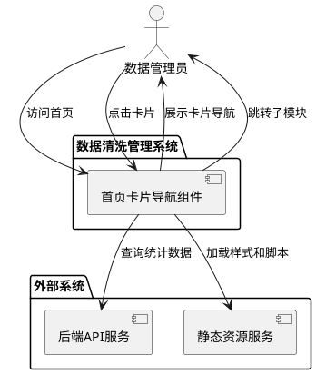
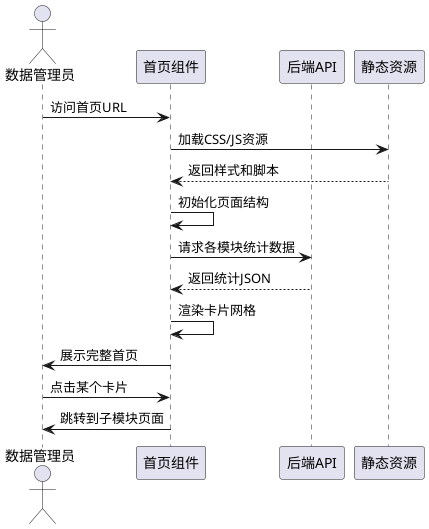
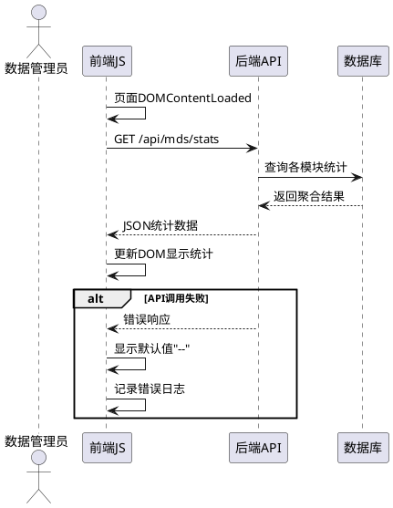
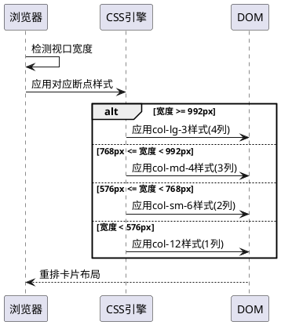

# **1. 组件定位**

## **1.1 核心职责**

本组件负责展示数据清洗管理系统的首页导航,提供卡片式模块入口和动态统计信息,实现快速访问各子模块的功能入口。

## **1.2 核心输入**

1. **用户访问请求**: 用户通过浏览器访问系统首页的HTTP请求
2. **统计数据查询请求**: 前端页面加载时发起的各模块统计数据查询请求
3. **模块配置信息**: 系统内部提供的模块配置数据(模块名称、图标、路由等)

## **1.3 核心输出**

1. **卡片式导航页面**: 渲染后的HTML页面,包含卡片布局和统计数据展示
2. **统计数据响应**: 各模块的待处理条数、校验状态等统计信息
3. **页面跳转**: 用户点击卡片后跳转到对应子模块页面

## **1.4 职责边界**

本组件不负责以下事项:

1. 不负责各子模块的具体业务逻辑处理
2. 不负责数据的导入、校验、推送等操作
3. 不负责用户权限验证(由后端中间件处理)
4. 不负责统计数据的复杂计算(由后端API提供)

# **2. 领域术语**

**导航卡片**
: 首页上用于展示子模块入口的卡片式UI组件,包含图标、标题、描述和统计信息。

**动态统计**
: 实时从后端API获取的各模块数据统计信息,如待处理条数、校验失败数等。

**子模块**
: 数据清洗管理系统的功能模块,包括物料、产线版本、工作中心、工艺路线、BOM、模具、机台模具。

**卡片布局**
: 将导航项从垂直列表形式改为网格卡片形式的UI布局方式,每个卡片占据固定的网格空间。

# **3. 角色与边界**

## **3.1 核心角色**

- **数据管理员**: 操作数据清洗管理系统的主要用户,通过首页导航进入各子模块进行数据管理操作

## **3.2 外部系统**

- **后端API服务**: 提供各模块统计数据的RESTful接口
- **静态资源服务**: 提供CSS、JavaScript、图标等前端静态资源

## **3.3 交互上下文**

# **4. DFX约束**

## **4.1 性能**

1. **首屏加载时间**: 当用户访问首页时,系统应在3秒内完成页面渲染和统计数据加载
2. **统计数据响应时间**: 当前端请求统计数据时,后端API应在2秒内返回响应
3. **并发请求支持**: 系统应支持至少50个用户同时访问首页而不影响性能

## **4.2 可靠性**

1. **统计数据降级**: If 统计数据API调用失败,则系统应显示默认占位符而不阻塞页面加载
2. **缓存策略**: While 统计数据未变化,则系统应使用缓存数据减少后端请求
3. **数据一致性**: Where 显示多个模块的统计数据,则所有统计数据应为同一时间点的快照

## **4.3 安全性**

1. **XSS防护**: 系统应对所有动态渲染的文本内容进行XSS过滤
2. **CSRF防护**: 所有统计数据API请求应包含有效的CSRF令牌
3. **权限控制**: While 用户未登录,则系统应重定向到登录页面

## **4.4 可维护性**

1. **模块配置化**: 系统应通过配置文件管理模块列表,而非硬编码
2. **样式统一性**: 卡片组件应复用Bootstrap组件库,保持样式一致性
3. **代码分离**: 前端JavaScript应将数据获取、渲染逻辑、事件处理分离

## **4.5 兼容性**

1. **浏览器兼容**: 系统应支持Chrome、Firefox、Edge、Safari的最新三个版本
2. **响应式设计**: While 屏幕宽度小于768px,则卡片应单列排列
3. **降级方案**: If 浏览器不支持CSS Grid,则应使用Flexbox降级布局

# **5. 核心能力**

## **5.1 卡片布局展示**

### **5.1.1 业务规则**

1. **卡片网格布局**: 系统应使用网格布局展示导航卡片,每个卡片占据相等的网格空间
   - 验收条件: [访问首页] → [卡片以网格形式排列,每行最多4个卡片]

2. **模块完整性**: 系统应展示所有7个子模块的导航卡片
   - 验收条件: [页面加载完成] → [显示物料、产线版本、工作中心、工艺路线、BOM、模具、机台模具共7个卡片]

3. **卡片信息完整性**: 每个卡片必须包含图标、标题、描述文字和统计信息区域
   - 验收条件: [查看任意卡片] → [卡片包含图标、标题、描述文字、统计数据展示区]

4. **卡片点击跳转**: When 用户点击卡片,则系统应跳转到对应子模块页面
   - 验收条件: [点击物料卡片] → [跳转到/mds/material页面]

5. **禁止项**: 系统禁止在卡片中展示敏感的业务数据详情
   - 验收条件: [查看任意卡片] → [仅显示统计数字,不展示具体数据记录]

### **5.1.2 交互流程**

### **5.1.3 异常场景**

1. **统计数据加载失败**
   - 触发条件: [后端API服务不可用或超时]
   - 系统行为: [捕获异常,使用默认值"--"替代统计数据,记录错误日志]
   - 用户感知: [卡片正常显示,统计区域显示"--",不阻塞页面]

2. **静态资源加载失败**
   - 触发条件: [CSS或JS文件加载失败]
   - 系统行为: [使用内联样式降级,确保基本功能可用]
   - 用户感知: [页面样式可能简化,但功能正常]

3. **网络连接异常**
   - 触发条件: [用户网络中断]
   - 系统行为: [显示网络错误提示,提供刷新按钮]
   - 用户感知: [提示"网络连接失败,请刷新页面重试"]

## **5.2 动态统计展示**

### **5.2.1 业务规则**

1. **待处理统计**: 系统应显示每个模块的待处理数据条数
   - 验收条件: [物料模块有100条待处理数据] → [物料卡片显示"待处理: 100条"]

2. **统计维度**: 统计数据应至少包含待处理条数,可扩展校验失败数、已推送数等维度
   - 验收条件: [查看任意卡片统计区] → [至少显示待处理条数统计]

3. **实时性**: When 页面加载或刷新,则系统应获取最新的统计数据
   - 验收条件: [刷新首页] → [统计数据与数据库实际数量一致]

4. **统计格式**: 统计数字应以千分位格式显示,超过9999显示为"9999+"
   - 验收条件: [某模块待处理数为12345] → [显示"待处理: 9,999+条"]

5. **禁止项**: 系统禁止缓存超过5分钟的统计数据
   - 验收条件: [查看统计缓存] → [缓存有效期不超过5分钟]

### **5.2.2 交互流程**

### **5.2.3 异常场景**

1. **统计查询超时**
   - 触发条件: [数据库查询超过2秒未返回]
   - 系统行为: [取消请求,使用缓存数据或默认值]
   - 用户感知: [统计区域显示"--"或"加载中"]

2. **统计API不存在**
   - 触发条件: [后端API接口返回404]
   - 系统行为: [跳过统计功能,卡片仅显示导航功能]
   - 用户感知: [卡片可正常点击跳转,统计区域隐藏]

3. **统计数据格式错误**
   - 触发条件: [后端返回非预期JSON格式]
   - 系统行为: [解析失败时使用默认值,记录错误]
   - 用户感知: [统计区域显示"--"]

## **5.3 响应式布局**

### **5.3.1 业务规则**

1. **大屏布局**: While 屏幕宽度≥992px,则每行显示4个卡片
   - 验收条件: [在1200px宽度屏幕查看] → [每行显示4个卡片]

2. **中屏布局**: While 屏幕宽度在768px-991px之间,则每行显示3个卡片
   - 验收条件: [在900px宽度屏幕查看] → [每行显示3个卡片]

3. **小屏布局**: While 屏幕宽度在576px-767px之间,则每行显示2个卡片
   - 验收条件: [在700px宽度屏幕查看] → [每行显示2个卡片]

4. **移动端布局**: While 屏幕宽度<576px,则每行显示1个卡片
   - 验收条件: [在手机屏幕查看] → [卡片单列排列]

5. **卡片尺寸一致性**: Where 同一行的卡片,则高度应保持一致
   - 验收条件: [查看任意一行卡片] → [该行所有卡片高度相同]

### **5.3.2 交互流程**

### **5.3.3 异常场景**

1. **浏览器不支持CSS Grid**
   - 触发条件: [用户使用不支持CSS Grid的旧浏览器]
   - 系统行为: [使用Flexbox降级方案]
   - 用户感知: [布局略有差异但功能完整]

2. **窗口尺寸频繁变化**
   - 触发条件: [用户频繁拖动窗口边缘改变大小]
   - 系统行为: [使用防抖处理避免频繁重排]
   - 用户感知: [布局平滑切换无卡顿]

# **6. 数据约束**

## **6.1 导航卡片数据**

1. **moduleId**: 模块唯一标识符,格式为小写字母加连字符,如"mat-wc-bom"
2. **moduleTitle**: 模块显示标题,中文描述,如"工艺路线"
3. **moduleIcon**: Bootstrap图标类名,格式为"bi-{icon-name}",如"bi-gear"
4. **moduleRoute**: 模块路由路径,格式为"/mds/{moduleId}",如"/mds/material"
5. **moduleDesc**: 模块功能描述,中文语句,长度不超过50字符
6. **statsPending**: 待处理数据条数,非负整数,显示时超过9999显示"9999+"
7. **statsValidationFailed**: 校验失败数据条数,非负整数,可选字段
8. **statsSynced**: 已推送数据条数,非负整数,可选字段

## **6.2 统计数据响应格式**

1. **moduleId**: 对应的模块标识符
2. **pending**: 待处理数量,类型为非负整数
3. **validationFailed**: 校验失败数量,类型为非负整数,可选
4. **synced**: 已推送数量,类型为非负整数,可选
5. **timestamp**: 统计快照时间戳,ISO 8601格式,如"2024-01-15T10:30:00Z"

## **6.3 页面配置数据**

1. **pageTitle**: 页面标题,固定值为"数据清洗管理系统"
2. **cardLayout**: 卡片布局配置,JSON对象,包含行列配置
3. **statsEnabled**: 是否启用统计功能,布尔值,默认为true
4. **cacheTimeout**: 统计数据缓存时长,整数,单位秒,默认300秒
